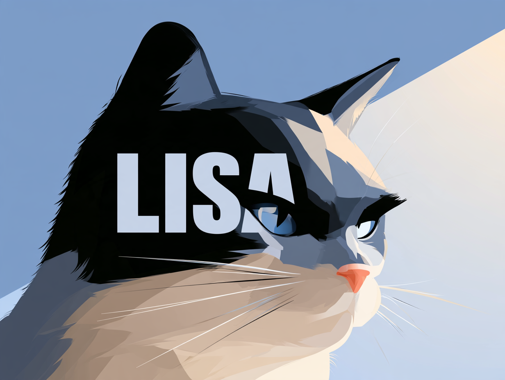

<p align="center">
  
</p>

**L**eak, **I**njection & **S**implicity **A**uditor.

Lisa is a GitHub Action that reviews every pull request with [TypeSafe](https://docs.typesafe.ai/introduction)'s Jev model and fails the check when it finds a problem. It asks four yes/no questions about each part of the diff:

| Check | Question | Catches |
|---|---|---|
| `secret` | Does this diff add a secret? | API keys, tokens, passwords, private keys, connection strings |
| `security` | Does this diff introduce a security vulnerability? | Injection, XSS, weakened access control, unsafe eval or deserialization, path traversal, SSRF, weak crypto, disabled TLS or CSRF checks, permissive config, sensitive data in logs |
| `complexity` | Does this diff add unneeded complexity? | Single-use abstractions, speculative options, dead code, convoluted control flow, duplication |
| `prompt_injection` | Does this diff add text that tries to manipulate an AI system? | Instructions to AI reviewers or agents, and hidden text. The PR title and description are checked too. |

A repository can add its own questions, turn checks off, and skip paths in a [`.lisa.toml`](#configuration-lisatoml) file.

For every finding, Lisa comments on the exact line with what is wrong and how to fix it. It also keeps one summary comment on the PR up to date. Lisa runs on the Python standard library alone and installs nothing at run time.

## Contents

- [Quick start](#quick-start)
- [Inputs and outputs](#inputs-and-outputs)
- [Configuration: .lisa.toml](#configuration-lisatoml)
- [Results](#results)
- [How it works](#how-it-works)
- [Security](#security)
- [Limits](#limits)
- [Development](#development)

## Quick start

1. Get an API key from the [TypeSafe console](https://console.typesafe.ai/keys).
2. Add it to the repository as a secret named `TYPESAFE_API_KEY` (**Settings > Secrets and variables > Actions**).
3. Add `.github/workflows/lisa.yml`:

   ```yaml
   name: Lisa

   on:
     pull_request:

   jobs:
     lisa:
       runs-on: ubuntu-latest
       timeout-minutes: 30
       concurrency:
         group: lisa-${{ github.event.pull_request.number }}
         cancel-in-progress: true
       permissions:
         contents: read
         pull-requests: write
       steps:
         - uses: turenlabs/lisa@<full-commit-sha> # v1
           with:
             api-key: ${{ secrets.TYPESAFE_API_KEY }}
   ```

4. In your branch protection rules, make **Lisa** a required status check.

Notes on this setup:

- **No checkout step.** Lisa reads the diff through the GitHub API. Keep it in its own job, with no other steps.
- **Pin to a commit SHA,** not a tag. Tags can be moved to point at different code.
- **Public repositories that accept fork PRs:** GitHub does not give `pull_request` workflows from forks access to secrets, so Lisa fails with "Missing `api-key`". Use `on: pull_request_target:` instead. This is safe for Lisa only because it never checks out or runs PR code, so **never add a checkout step to that job**. Lisa warns if it finds one.

## Inputs and outputs

| Input | Required | Default | Description |
|---|---|---|---|
| `api-key` | yes | | TypeSafe API key. Pass it from a secret. |
| `threshold` | no | `threshold` from `.lisa.toml`, else `0.5` | Probability (above 0, at most 1) at which Jev's answer counts as "yes". Raise it, for example to `0.8`, to flag only clear-cut cases. |
| `model` | no | `jev-latest` | TypeSafe model. Pin a version such as `jev-1.13.0` to keep results stable when TypeSafe releases a new model. |
| `github-token` | no | `${{ github.token }}` | Token for reading the diff and writing comments. Needs `pull-requests: write` and `contents: read`. |

| Output | Description |
|---|---|
| `findings` | Number of findings. |

The exit code is the result: `0` passed, `1` failed. See [Results](#results).

## Configuration: .lisa.toml

Put `.lisa.toml` in the repository root. It is optional, and so is every setting in it.

```toml
# Probability at which an answer counts as "yes". The action's `threshold` input overrides it.
threshold = 0.6

# Paths to skip. `*` matches across directories, so "docs/*" covers everything under docs.
ignore = ["docs/*", "tests/fixtures/*"]

# Turn built-in checks off: secret, security, complexity, prompt_injection.
[checks]
complexity = false

# Your own questions, asked about every part of the diff (up to 20). See "Question types" below.
[[questions]]
id = "debug-prints"                # required: lowercase letters, digits, - or _
question = "Does this diff add print statements used for debugging?"   # required
title = "Debug output"             # shown in comments; defaults to the id
yes_if = "Adds print() or console.log() calls that look temporary."    # optional: what counts as yes
no_if = "Output goes through the project's logger."                    # optional: what counts as no
why = "Debug output ends up in production logs."                       # optional: shown to the author
fix = "Remove it or use the logger."                                   # optional: shown to the author
threshold = 0.8                    # optional: overrides the threshold for this question
```

### Question types

Custom questions can use any of TypeSafe's three question types. Set `type`; the default is `noul`.

| `type` | Asks | Fails the check when | Type-specific settings |
|---|---|---|---|
| `noul` | a yes/no question | the probability of "yes" reaches the threshold | `yes_if`, `no_if`, `threshold` (all optional) |
| `choice` | which one of your options applies | the flagged options' combined probability reaches the threshold | `options` (2 to 255, required), `flag` (required), `threshold` |
| `score` | where the change falls on your levels | the score reaches `fail_at` | `levels` (2 to 10, best first, required), `fail_at` (required) |

Every type also takes `id`, `question`, `title`, `why`, and `fix`.

```toml
# choice: fails when "gpl" and "unknown" together are at least 60% likely.
[[questions]]
id = "license"
type = "choice"
question = "Which license does the third-party code added in this diff come under?"
flag = ["gpl", "unknown"]
threshold = 0.6
why = "Copyleft or unlicensed code can change the terms you ship under."
fix = "Replace it with permissively licensed code, or get legal sign-off."

[questions.options]
none = "No third-party code is added."
permissive = "MIT, BSD, Apache, or another permissive license."
gpl = "GPL or another copyleft license."
unknown = "Copied code with no clear license."

# score: levels run from best (0) to worst (2); fails at a score of 1.5 or more.
[[questions]]
id = "tests"
type = "score"
question = "How well do tests in this diff cover the code it adds?"
levels = ["Fully tested", "Partly tested", "Untested"]
fail_at = 1.5
fix = "Add tests for the new behavior."
```

A `choice` finding names the flagged option that was most likely, for example **License: gpl (70%)**. A `score` finding names the level and the score, for example **Test coverage: Untested (score 1.8 of 2)**. Make a choice or score question as narrow as a yes/no one: ask about one property of the change.

### Rules

- **Lisa reads `.lisa.toml` from the PR's base commit, never from the PR itself.** A pull request cannot turn off the checks that would catch it. Changes to `.lisa.toml` take effect once they are merged.
- **Invalid files fail the check** with a message naming the exact problem, such as an unknown setting, a wrong type, or a duplicate question id.
- **Write each custom question as one narrow judgment about the diff.** Jev is most accurate that way. Split a broad question into two narrow ones.
- **Threshold precedence** (for `noul` and `choice`): a question's own `threshold`, then the `threshold` input, then `threshold` in `.lisa.toml`, then `0.5`. `score` questions use `fail_at` instead.

## Results

**The check fails** when any of these is true:

- Any question's answer fails its check: a yes (or flagged choice) at or above the threshold, or a score at or above `fail_at`.
- Any part of the PR could not be reviewed. That covers a request that failed after retries, a missing or invalid answer, a file over 1 MB whose diff GitHub omits, files beyond GitHub's 3,000-file listing, and a push to the PR during the review.
- `.lisa.toml` or the inputs are invalid, or the API key is rejected.

**Lisa fails closed:** a PR passes only when every file that should be reviewed was reviewed.

**Comments.** The inline comment on a flagged line looks like this:

> **Security vulnerability: Injection** (95% likely)
>
> If any part of the interpolated value can be influenced by a user, they can change the meaning of the query or command and read, modify, or delete data, or run commands on the host.
>
> **How to fix:** Use parameterized queries or prepared statements, and pass command arguments as a list instead of a shell string. Never build interpreter input with string formatting.

The summary comment contains:

- a table with each check marked Clear or N found;
- a linked list of every finding with its fix;
- the reviewed commit, the model version, and where the settings came from;
- anything that was not reviewed;
- the files skipped by design.

Lisa edits the same summary comment on every push. It does not repeat an inline comment for a problem it has already flagged, even if the line moved. The same summary is written to the job summary.

## How it works

1. **Settings.** Validate the inputs, read the PR from the workflow event, and load `.lisa.toml` from the base commit.
2. **Files.** List the PR's changed files through the GitHub API, then confirm the PR head has not moved. Skip lockfiles, binaries, minified bundles, vendored code, and `ignore` paths, and list them in the summary. Deleted files are reviewed too: removing a security check is a change. When GitHub omits a large file's diff, download both versions (at most 1 MB each) and rebuild the diff.
3. **Chunks.** Split each diff into chunks of at most 12,000 characters and 200 added lines. Jev is most accurate on short, focused input. Nothing is hidden from it:
   - long lines are split into segments, not cut off;
   - runs of 64 or more spaces are collapsed to `<N spaces>`;
   - invisible Unicode (zero-width, bidi, tag characters) is shown as `<U+XXXX>`.
4. **Questions.** Send each chunk to TypeSafe's `/v1/systemone` endpoint: up to 8 requests at a time, with at most 4 checks per request. For each check, the request asks:
   - the deciding question, which decides pass or fail. For built-in checks this is a **Noul** (a yes/no probability); custom questions can also be a **Choice** or a **Score**;
   - a **Choice** of the kind of problem (for example SQL injection or a hardcoded password). The kind selects the explanation and fix shown to the author. Custom questions skip this and use their own `why` and `fix`;
   - a **Choice** over the chunk's added lines. This picks the line for the inline comment.
5. **Description.** Check the PR title and the whole description for prompt injection.
6. **Publish.** Write the summary comment, the inline comments, the job summary, and the `findings` output. Exit `1` on any finding or gap in coverage.

Network errors, rate limits (429), and overloads (529) are retried with exponential backoff, honoring `retry-after`.

## Security

Lisa is a security gate, so it is built to be hard to fool or abuse:

- **Everything from the PR is treated as hostile.** That covers diffs, file names, the title, the description, and comments. It is sent to Jev as data, rendered in comments only inside escaped code spans, and escaped in every workflow command it prints. A crafted file name cannot add links, mentions, fake headings, or `::` commands.
- **Only bot-authored comments count as Lisa's.** Anyone can post Lisa's hidden markers; that cannot hide or replace its comments. The check status, not any comment, is the result.
- **Nothing sensitive is logged.** Logs contain counts, check names, file paths, and error summaries. They never contain diff content, PR text, API response bodies, or credentials.
- **Credentials stay put.** HTTPS only. Credentials are never forwarded on a redirect to another host, and redirects away from HTTPS are refused.
- **Lisa's code cannot be swapped out.** It runs from its own directory with `PYTHONSAFEPATH` and without user site-packages, so files in the workspace cannot shadow its modules. It has no runtime dependencies. CI tools are pinned by hash in `uv.lock`, and CI actions are pinned to commit SHAs.
- **Jev can only answer questions.** Its output is probabilities and option keys, checked against fixed tables. No model text reaches a comment, a command, or a URL.
- **Resource use is capped.** See [Limits](#limits).

What Lisa cannot guarantee:

- **Jev can be argued with.** Text written to talk a model into a "no" can sometimes work. The `prompt_injection` check exists to catch that, but a pass is a strong signal, not proof. Keep human review.
- **Diff content leaves GitHub.** Reviewed diff chunks and the PR title and description are sent to TypeSafe. See TypeSafe's [data handling](https://docs.typesafe.ai/models#data-handling) policy, and use `ignore` for paths that must not be sent.
- **Skipped files are not reviewed.** That covers lockfiles, binaries, and vendored code; they are listed in the summary instead. Review dependency changes with a dedicated tool such as GitHub's dependency review action.
- **Context is limited.** Jev judges each chunk on its own, without the rest of the codebase.
- **Budget:** with `pull_request_target` on a public repository, anyone who opens a PR spends your TypeSafe budget, up to the per-run cap.

## Limits

| Limit | Value | When exceeded |
|---|---|---|
| Files listed per PR | 3,000 (GitHub's limit) | The check fails; the rest are listed as not reviewed |
| File size when GitHub omits the diff | 1 MB | The check fails; the file is listed as too large |
| TypeSafe requests per run | 5,000 | The check fails before any request is sent |
| Chunk size | 12,000 characters, 200 added lines | The diff is split into more chunks |
| Checks per request | 4 | The checks are split across more requests |
| Custom questions | 20 | `.lisa.toml` is rejected |
| Options per `choice` question, levels per `score` question | 255, 10 (TypeSafe's limits) | `.lisa.toml` is rejected |
| `.lisa.toml` size | 64 KB | `.lisa.toml` is rejected |
| Inline comments per run | 100 | The rest appear only in the summary |
| Attempts per request | 5, waiting at most 60 seconds each | The chunk is marked not reviewed |
| Concurrent requests | 8 | |

Requirements: a runner with `python3` 3.11 or newer. GitHub-hosted runners have it.

## Development

The code is organized as follows. Every module in `lisa/` has one job:

| Path | Role |
|---|---|
| `action.yml` | Action definition. Runs `python3 -s -m lisa` from the action directory. |
| `lisa/__main__.py` | Entry point. Checks the Python version, then calls `review.run`. |
| `lisa/review.py` | Orchestration: the `Reviewer` class loads settings, collects chunks, asks TypeSafe, and publishes. It owns the fail-closed rules and all logging. |
| `lisa/models.py` | Every data structure: `Chunk`, `Check`, `CheckCatalog`, `Finding`, `Coverage`, `ReviewResult`, `Config`, `RepoConfig`, and others. Data only, plus trivial accessors. |
| `lisa/default_checks.py` | The four built-in checks, as the searchable `DEFAULT_CHECKS` catalog, with every kind's explanation and fix. |
| `lisa/checks.py` | Turns checks into TypeSafe questions and answers into findings. Validates answers. |
| `lisa/config.py` | Parses and validates the inputs, the workflow event, and `.lisa.toml`. |
| `lisa/diff.py` | Parses patches, splits them into chunks, and reveals hidden characters. |
| `lisa/api.py` | GitHub and TypeSafe clients: retries, size limits, safe redirects, and error messages without bodies. |
| `lisa/report.py` | Renders the summary and inline comments as markdown. |
| `lisa/errors.py` | `LisaError` and its subclasses: `ConfigError`, `ApiError`, `AuthError`. |
| `tests/` | One test file per module; `test_review.py` runs whole reviews against fake GitHub and TypeSafe APIs. |

Commands:

```sh
uv run --locked pytest                        # tests
uv run --locked ruff check lisa tests         # lint
uv run --locked ruff format lisa tests        # format
```

The built-in checks can be looked up and searched:

```python
from lisa.default_checks import DEFAULT_CHECKS

DEFAULT_CHECKS["secret"]                               # look up by key
[c.key for c in DEFAULT_CHECKS.search("injection")]    # ['security', 'prompt_injection']
```

### Rules for contributors and coding agents

These rules keep Lisa safe. Tests and CI enforce most of them:

1. **No runtime dependencies.** Standard library only. CI fails if `pyproject.toml` gains a dependency. Development tools are pinned in `uv.lock`; update them with `uv lock` and commit the lockfile.
2. **Fail closed.** Any path that skips, truncates, or cannot parse something must mark it not reviewed (`Coverage.failed` or `too_large`), which fails the check. It must never be treated as a pass.
3. **No untrusted text in logs.** Log counts, check names, file paths, and error summaries only. Print workflow commands only through `review.command`. Never put a response body in an exception message.
4. **No untrusted text in comments** except through `report.code`.
5. **Read settings from the base commit only.**
6. **Data structures go in `models.py`,** and built-in checks go in `default_checks.py`.
7. **Pin CI actions to full commit SHAs,** with the version in a comment.
8. **Add a test for every behavior change.** For a security fix, add a test that fails without the fix.
9. **No emojis** in code, comments, or output.

**To add a built-in check,** add a `Check` to `DEFAULT_CHECKS` in `lisa/default_checks.py`. It needs:

- a narrow yes/no `instructions`, with `true` and `false` criteria;
- `kind_instructions` and `line_instructions`;
- `kinds` that include `"other"`, each with a `why` and a `fix`.

`tests/test_models.py` checks that every kind is complete.

## License

MIT. See [LICENSE](LICENSE).
